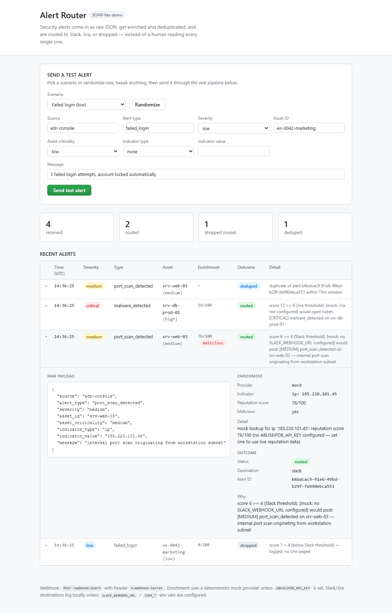

# Alert Router — SOAR-lite

[](https://github.com/wadie-ejjoufari/alert-router/actions/workflows/tests.yml)

A small, self-contained alerting pipeline: security alerts come in as raw JSON, get
enriched with threat-intel context and deduplicated, and are automatically routed to
Slack, a Jira ticket, or dropped as noise — instead of a human reading every single one.

**Try it live in 10 seconds, no setup:** pick a scenario (or hit Randomize) and click
"Send test alert" on the running demo. Each click fires a realistic alert through the
real pipeline below and you watch it get enriched, scored, and routed (or dropped) in
real time — then click any row to see the raw payload and the full reasoning behind
the decision.



---

## The problem

Security teams — and any team running an EDR, a WAF, or app monitoring — end up with raw
alert JSON landing in a shared inbox or a noisy Slack channel. Every alert gets read by a
human, regardless of whether it matters. Real incidents get lost in low-value noise, and
the same underlying event often fires multiple near-identical alerts that all get triaged
separately.

## The approach

A webhook endpoint accepts alert JSON from any source shaped roughly like an EDR/SIEM
alert (severity, asset, an optional IP/hash indicator). Each alert is:

1. **Deduplicated** — an identical alert (same source, type, asset, indicator) within a
   configurable window is recognized and short-circuited, not re-processed.
2. **Enriched** — an IP or file-hash indicator gets a reputation lookup. Works out of the
   box with a deterministic mock provider (same indicator always scores the same way);
   drop in a real `ABUSEIPDB_API_KEY` and it switches to live threat-intel data with zero
   code changes.
3. **Routed** — severity, asset criticality, and enrichment combine into a score that
   decides the outcome: open a Jira ticket, post to Slack, or drop it as noise. Most
   alerts should be dropped — that's the point of a router, not a bug.
4. **Logged** — every decision, including drops, is visible on the dashboard with the
   reasoning behind it, so the routing logic isn't a black box.

Slack and Jira delivery work exactly the same way as enrichment: real credentials trigger
real delivery, no credentials means the app logs exactly what it *would* have sent — so
the whole pipeline, including the routing decisions, is demonstrable without you handing
over any of your own tools' credentials.

## The result

A cold visitor can click one button and watch, within a few seconds: one alert dropped as
noise, one routed to Slack, one opening a Jira ticket, and a repeat of an earlier alert
correctly recognized as a duplicate instead of re-alerting. That's the full loop a real
integration would need — receive, enrich, decide, deliver — in one small service.

---

## Quick start (local)

```bash
git clone <this-repo>
cd alert-router
cp .env.example .env        # optional — the app runs fully functional with none of this set
pip install -r requirements.txt
python wsgi.py               # or: docker compose up --build
```

Visit `http://localhost:8000`, pick a scenario from the dropdown (or hit **Randomize**),
tweak any field, and click **Send test alert**.

## Sending a real alert

```bash
curl -X POST http://localhost:8000/webhook/alert \
  -H "Content-Type: application/json" \
  -H "X-Webhook-Secret: changeme-dev-secret" \
  -d '{
    "source": "edr-console",
    "alert_type": "malware_detected",
    "severity": "critical",
    "asset_id": "srv-db-prod-01",
    "asset_criticality": "high",
    "indicator_type": "hash",
    "indicator_value": "e99a18c428cb38d5f260853678922e03",
    "message": "known ransomware signature quarantined"
  }'
```

The webhook (and the demo-send form) are rate-limited per IP — 30 and 20 requests per
minute respectively — returning `429` past that. See [Scope, deliberately
cut](#scope-deliberately-cut).

## Configuration

Everything is optional. Copy `.env.example` to `.env` and fill in whichever pieces you
have — anything left blank falls back to a safe, visible mock.

| Variable | Effect when set |
|---|---|
| `WEBHOOK_SHARED_SECRET` | Required header value on `/webhook/alert`. **Change this before deploying publicly.** |
| `ABUSEIPDB_API_KEY` | Enrichment uses real AbuseIPDB lookups for IP indicators instead of the deterministic mock. |
| `SLACK_WEBHOOK_URL` | Slack-routed alerts post for real instead of being logged as "would post." |
| `JIRA_BASE_URL` / `JIRA_EMAIL` / `JIRA_API_TOKEN` / `JIRA_PROJECT_KEY` | Jira-routed alerts open a real ticket instead of being logged as "would open." |
| `DEDUP_WINDOW_MINUTES` | How long an identical alert is treated as a duplicate (default 15). |

## Routing rules

`severity × asset_criticality`, plus a bump if the enrichment lookup flags the indicator
as malicious:

| Combined score | Destination |
|---|---|
| ≥ 9 | Jira ticket |
| 4 – 8 | Slack message |
| < 4 | Dropped (logged, no one paged) |

This is deliberately simple — the point being demonstrated is the *pipeline*
(dedup → enrich → route → log), not a sophisticated scoring model. The thresholds live in
`app/routing.py` and are easy to tune per team.

## Scope, deliberately cut

- No auth beyond the shared-secret header — no user accounts, no multi-tenancy.
- Two delivery destinations (Slack, Jira), not a general integration platform.
- One SQLite file, not built for high alert volume.
- Rate limiting is a simple in-memory per-IP sliding window (`app/ratelimit.py`) —
  enough to blunt casual scripted abuse of the public webhook and demo-send endpoints,
  not a substitute for a real gateway (Redis, Cloudflare, an API gateway) under
  production traffic.

These are the right cuts for a demonstration of the pattern; a production version would
add per-client rule config, more destinations, and a proper queue in front of delivery.

## Deploying

Deployed on [Render](https://render.com)'s free tier via the included
[`render.yaml`](render.yaml) blueprint: in the Render dashboard, **New → Blueprint**,
connect this repo, and it picks up the Dockerfile, health check, and env vars
automatically — `WEBHOOK_SHARED_SECRET` is generated for you rather than left at the
`changeme-dev-secret` default.

The free tier has no persistent disk, so the SQLite file is ephemeral — demo data
resets on restart or redeploy. That's a fine trade for a free, always-reachable demo;
a production deployment would move to a managed Postgres instance instead.

## Tests

```bash
python -m unittest discover -s tests -v
```

Covers dedup hashing, routing thresholds, the enrichment mock/fallback behavior, the
full webhook flow (auth, validation, dedup, and the demo button) end to end, and the
per-IP rate limiter. Runs automatically on every push via [GitHub
Actions](.github/workflows/tests.yml).
